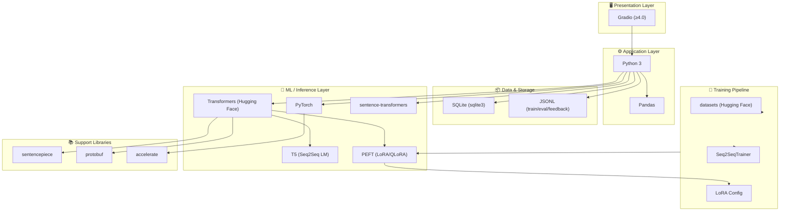
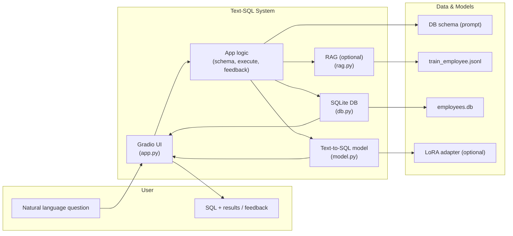
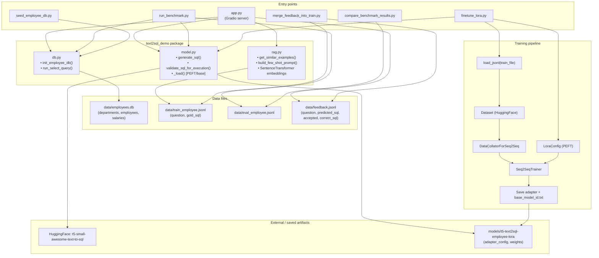
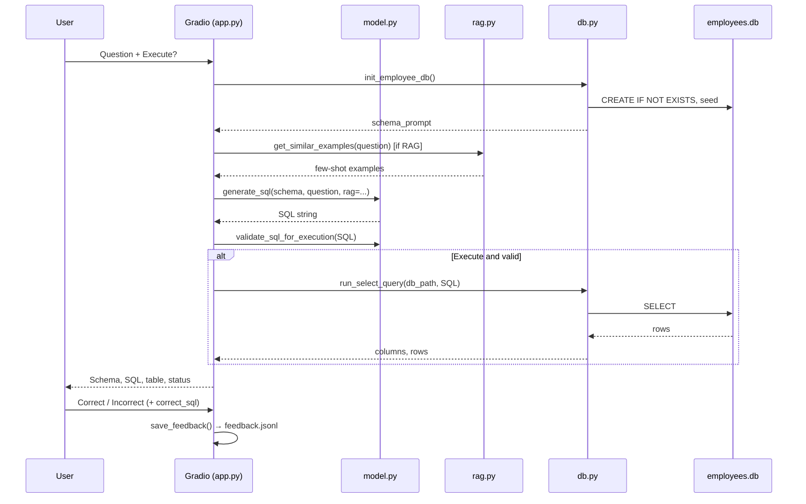

# Text-SQL System Design

**Diagram view:** Open [SYSTEM_DESIGN_DIAGRAMS.html](SYSTEM_DESIGN_DIAGRAMS.html) in a browser to see all diagrams rendered visually.

This document describes the architecture of the **text-sql** project: a Text-to-SQL application that converts natural language questions into SQLite queries using a small T5 model, with optional LoRA fine-tuning, RAG at inference, and human feedback learning.

---

## 1. Tech Stack Diagram

The following diagram shows all technologies used across the application layers.

### Tech Stack Summary

| Layer | Technology | Purpose |
|-------|------------|---------|
| **UI** | Gradio | Web UI for questions, SQL output, results, and feedback |
| **Runtime** | Python 3 | Application and scripts |
| **Data display** | Pandas | Query results as DataFrames in Gradio |
| **ML framework** | PyTorch | Model execution and training |
| **NLP / Model** | Transformers | T5 model load/generate; Seq2Seq training |
| **Base model** | `cssupport/t5-small-awesome-text-to-sql` | Pre-trained text-to-SQL T5 |
| **Adaptation** | PEFT (LoRA/QLoRA) | Fine-tuned adapters, optional 4-bit |
| **RAG** | sentence-transformers | Embeddings for few-shot example retrieval |
| **Database** | SQLite (stdlib `sqlite3`) | Employee sample DB and query execution |
| **Training data** | JSONL | train/eval/feedback (question, gold_sql) |
| **Training** | datasets, Seq2SeqTrainer | Data loading and LoRA fine-tuning |
| **Support** | sentencepiece, protobuf, accelerate | Tokenization, serialization, distributed training |

---

## 2. High-Level System Diagram

End-to-end flow: user question → UI → app → model/DB/RAG → response.

### High-Level Flow (Steps)

1. **User** enters a natural language question in the Gradio UI.
2. **App** loads DB schema, optionally retrieves similar (question, SQL) examples via **RAG** from `train_employee.jsonl`.
3. **Model** receives schema + (optional) few-shot examples + question, generates SQL (using base T5 + optional LoRA adapter).
4. **App** validates SQL (SELECT-only), then **DB** runs it against `employees.db` and returns columns/rows.
5. **UI** shows generated SQL, result table, and status; user can mark Correct/Incorrect and optionally provide correct SQL.
6. **Feedback** is written to `feedback.jsonl`; `merge_feedback_into_train.py` and `finetune_lora.py` implement the human-feedback learning loop.

---

## 3. Low-Level System Diagram

Detailed components, files, and data flow.

### Low-Level Component Roles

| Component | File(s) | Responsibility |
|-----------|---------|----------------|
| **Web UI** | `app.py` | Gradio Blocks: question input, execute checkbox, schema/SQL/result/status, Correct/Incorrect feedback, examples. Calls `handle()` → model + db + feedback save. |
| **SQL generation** | `text2sql_demo/model.py` | Load base or PEFT adapter; build prompt (schema ± RAG few-shot); tokenize; beam decode; extract SELECT; validate for execution. |
| **RAG** | `text2sql_demo/rag.py` | Load JSONL examples; embed questions (sentence-transformers); cosine similarity; return top-k; build few-shot prompt. |
| **Database** | `text2sql_demo/db.py` | Create/seed SQLite schema; return schema string for prompt; run SELECT and return (columns, rows). |
| **Benchmark** | `run_benchmark.py` | Load eval JSONL; for each (question, gold_sql): generate SQL, compare exact/execution match; write results JSON. |
| **Fine-tuning** | `finetune_lora.py` | Load train/eval JSONL; build "tables:" + schema + "query for: Q" inputs; Seq2SeqTrainer + LoRA; save adapter and base_model_id.txt. |
| **Feedback loop** | `merge_feedback_into_train.py` | Read feedback.jsonl; merge corrections (correct_sql or accepted predicted_sql) into training JSONL for re-fine-tuning. |
| **Comparison** | `compare_benchmark_results.py` | Compare baseline vs after-LoRA result JSONs. |

### Environment / Configuration

- `TEXT2SQL_MODEL_ID`: path or ID for model (e.g. `models/t5-text2sql-employee-lora`).
- `TEXT2SQL_RAG_EXAMPLES`: path to JSONL for RAG (default `data/train_employee.jsonl`).
- DB path: `data/employees.db` (overridable in scripts).

---

## 4. Data Flow Summary

---

This file is the single system design document for **text-sql**, containing tech stack, high-level and low-level architecture, and main data flows.
